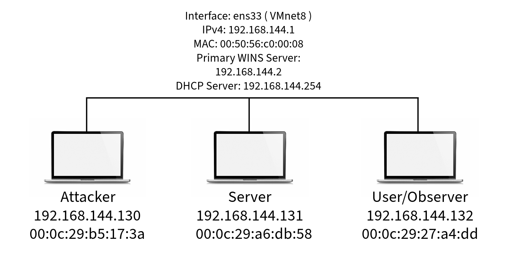

# Packet-Sniffing-and-IP-Spoofing

## Network Diagram for Virtual Environment


## Setup Virtual Machines (VM)
### Download the virtual machine file (VM):
https://drive.google.com/file/d/138fqx0F8bThLm9ka8cnuxmrD6irtz_4m/view

### Virtual Machine Setup:
https://github.com/seed-labs/seed-labs/blob/master/manuals/vm/seedvm-manual.md

#### Once VM is setup, verify VMs is up-to-date with the following commands: 
***Run this command on all of the VMs***
 ```console
 ~$ sudo apt-get update && sudo apt-get dist-upgrade
 ```

#### Verify the **Attacker** VM has ***Python*** and ***Scapy*** library installed
*Verify if Python is installed with either of the following command:*
```console
~$ python3 --version 
    or
~$ python --version
```
*Install Python using the following link:*
**https://www.python.org/downloads/**

*Install Scapy with the following command:*
```console
~$ python3 install scapy
    or
~$ python install scapy
```

## Run Python scripts on the Attacker VM
**Use Python files from src folder**

*Make Python file an executable file:* 
```console
~$ chmod a+x sniff_and_spoof.py
```

*Must become root user to run sniffer script:*
```console
~$ sudo -i
```
*Run python script:*
```console
~% python3 sniff_and_spoof.py
    or
~$ python sniff_and_spoof.py
```